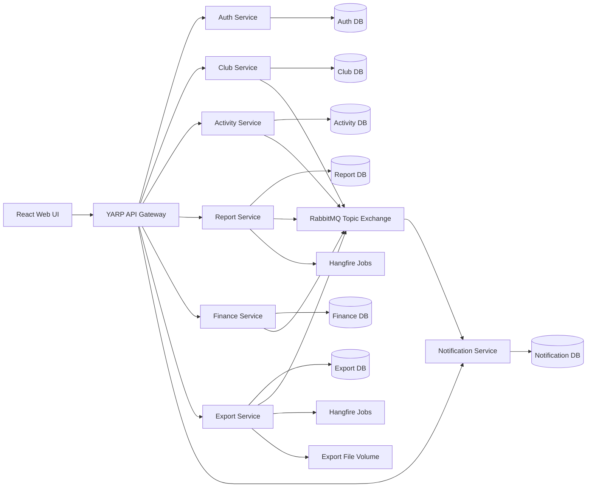
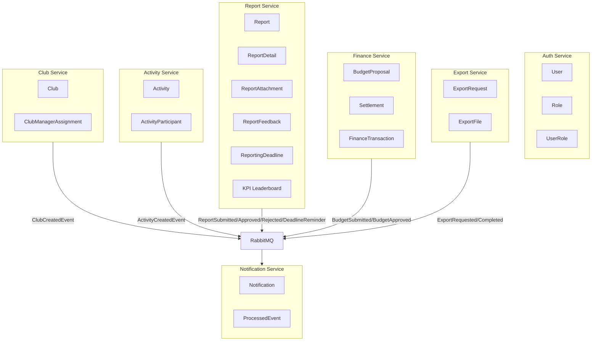
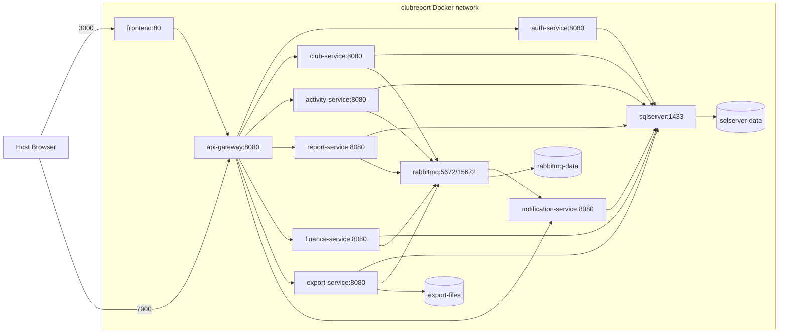
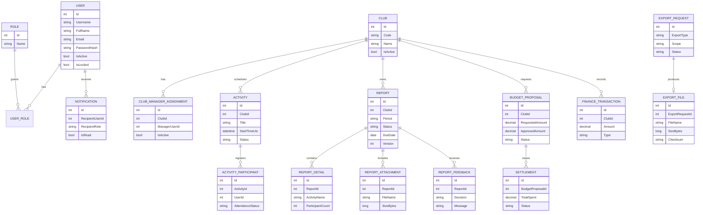

# Architecture and Diagrams

## System Architecture

## Microservices Diagram

## Deployment Diagram

## ERD

## Business Events

| Event | Publisher | Subscriber |
| --- | --- | --- |
| `club.created` | Club Service | Notification Service |
| `activity.created` | Activity Service | Notification Service |
| `report.submitted` | Report Service | Notification Service |
| `report.approved` | Report Service | Notification Service |
| `report.rejected` | Report Service | Notification Service |
| `kpi.calculated` | Report Service | Notification Service |
| `budget.proposal.submitted` | Finance Service | Notification Service |
| `budget.approved` | Finance Service | Notification Service |
| `settlement.overdue` | Finance Service | Notification Service |
| `export.requested` | Export Service | Export worker/logging path |
| `export.completed` | Export Service | Notification Service |
| `report.deadline.reminder` | Report Hangfire job | Notification Service |
