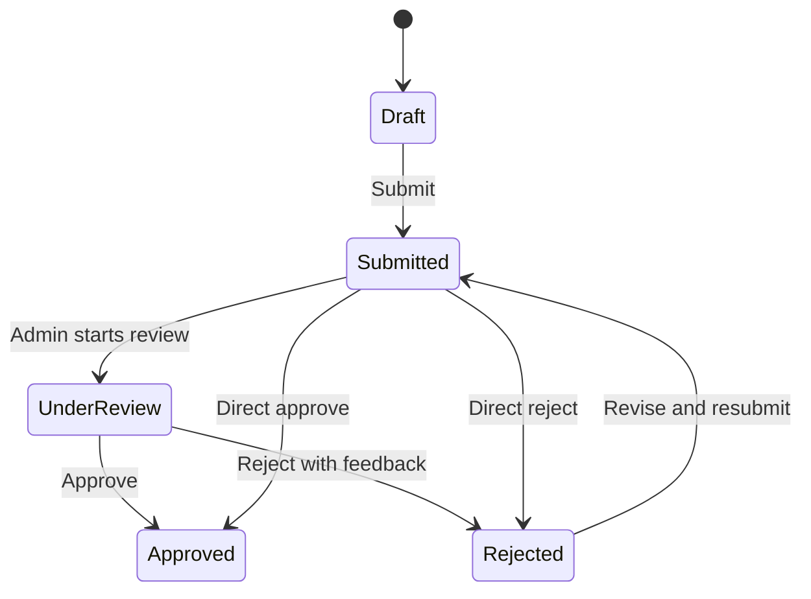

# User Guide

## Administrator

1. Log in with `admin@club.local` / `Admin@12345`.
2. Open Dashboard to view report counts, submitted reports, approved reports, overdue reports, and unread notifications.
3. Open Reports to review submitted reports.
4. Use the review action to move a submitted report to Under Review.
5. Approve a valid report or reject it with feedback.
6. Open Clubs to inspect active clubs and manager assignments.
7. Open Exports to request PDF or Excel exports.
8. Open Notifications to inspect system events from RabbitMQ.

## Club Manager

1. Log in with `manager@club.local` / `Manager@12345`.
2. Open Reports.
3. Create a demo report draft.
4. Upload supporting evidence from the report row before or after saving the draft.
5. Submit a draft or rejected report for administrator review.
6. Read notifications and feedback after approval or rejection.
7. Request or download approved outputs when available.

## Status Flow

