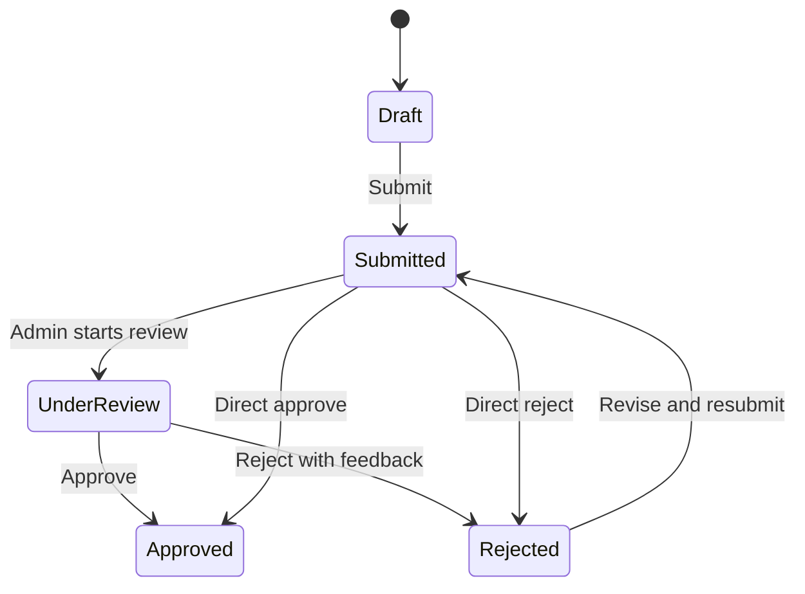

# User Guide

## Administrator

1. Log in with `admin@club.local` / `Admin@12345`.
2. Open Dashboard to view report counts, KPI score, budget proposal counts, activity summaries, and unread notifications.
3. Open Reports to review submitted reports.
4. Use the review action to move a submitted report to Under Review.
5. Approve a valid report or reject it with feedback.
6. Open Clubs to inspect active clubs and manager assignments.
7. Open KPI to inspect club leaderboard scores.
8. Open Finance to approve submitted budget proposals.
9. Open Exports to request PDF or Excel exports.
10. Open Notifications to inspect system events from RabbitMQ.

## Club Manager

1. Log in with `manager@club.local` / `Manager@12345`.
2. Open Reports.
3. Create a demo report draft.
4. Upload supporting evidence from the report row before or after saving the draft.
5. Submit a draft or rejected report for administrator review.
6. Read notifications and feedback after approval or rejection.
7. Request or download approved outputs when available.

## Treasurer

1. Log in with `treasurer@club.local` / `Treasurer@12345`.
2. Open Finance.
3. Create a demo budget proposal for the first seeded club.
4. Track Submitted, Approved, Rejected, and Settled finance status.

## Student / Club Member

1. Log in with `student@club.local` / `Student@12345`.
2. Open Clubs to view available clubs.
3. Open Activities to inspect the club activity calendar.
4. Open KPI to view club rankings.
5. Open Notifications to read activity and system signals.

## Status Flow

